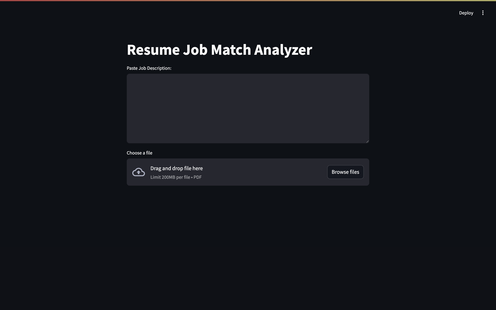
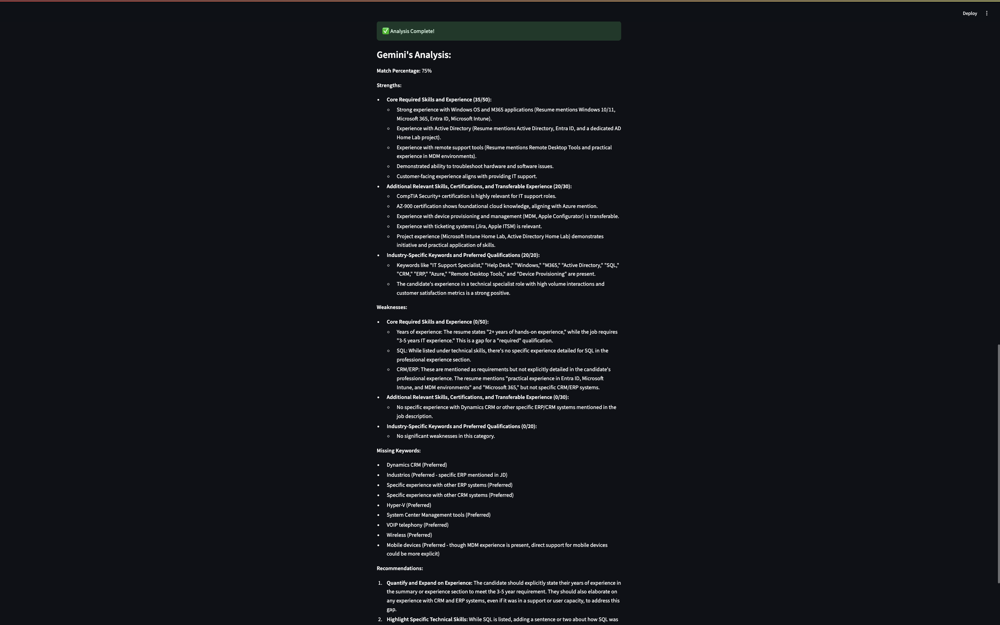

# ATS Resume Evaluator
A Streamlit-powered tool that compares a resume against a job description using Google's Gemini AI. The app extracts text from a PDF resume, evaluates its relevance to a job description, and returns a structured analysis including a match percentage, strengths, gaps, missing keywords, and tailoring recommendations to help optimize resumes for Applicant Tracking Systems (ATS).




## Features
- Upload a PDF resume for analysis
- Extract text via OCR (Tesseract) for image-based or scanned resumes
- Compare resume against a pasted job description
- Get a match percentage with breakdown across required vs. preferred qualifications
- Identify missing keywords flagged as required or preferred
- Receive actionable recommendations to improve match
- Smart caching to avoid redundant API calls on Streamlit reruns
- Automatic retry with exponential backoff on transient API errors
- Friendly error messages for rate limits and service outages

## Tech Stack
- Python 3.10+
- Streamlit — UI framework
- Google Gemini API (google-genai SDK) — resume analysis
- pytesseract — OCR text extraction
- pdf2image — PDF to image conversion
- python-dotenv — environment variable management

## Architecture
The app is structured around a few key patterns:

- Prompts are split into system and user components. The static instructions (persona, scoring rules, output format) live in prompts.py as RESUME_ANALYSIS_SYSTEM and are sent to Gemini via system_instruction. The dynamic data (today's date, the job description, the resume) is built per-request and sent as contents.
- Caching at the result layer. OCR and Gemini calls are decorated with @st.cache_data, keyed on their inputs. Identical resume/JD pairs return the cached analysis instantly without hitting the API.
- Retry at the network layer. Transient 503 errors are retried up to three times with exponential backoff before surfacing to the user.
- Errors are not cached. Failed API calls raise exceptions instead of returning error strings, so Streamlit doesn't cache failure states.
- Session state controls UI flow. A running flag disables the analyze button while a request is in flight, preventing duplicate calls.

## Installation
### Prerequisites

- Python 3.10 or higher (python --version to check)
- Tesseract OCR installed at the system level
  - macOS: brew install tesseract
  - Ubuntu/Debian: sudo apt install tesseract-ocr
  - Windows: download installer
- Poppler (required by pdf2image)
  - macOS: brew install poppler
  - Ubuntu/Debian: sudo apt install poppler-utils
  - Windows: installation guide
    
### Steps
1. Clone the repository: <br/>
  ```bash
  https://github.com/Saromazzotta/ats.git
  cd ats
  ```
2. Create and activate a virtual environment:
   ```python -m venv venv
   source venv/bin/activate          # macOS/Linux
   venv\Scripts\activate             # Windows
   ```
3. Install dependencies:
  ```bash
  pip install -r requirements.txt
  ```
## API Key Setup
You'll need an API key to use Google Gemini.
  1. Go to [Google AI Studio](https://aistudio.google.com/apikey)
  2. Generate an API key.
  3. Create a `.env` file in the project root and add the following line:
  ```bash   
    MY_API_KEY=your_google_gemini_api_key
  ```

The .env file is gitignored — never commit your API key to the repository.

5. Run the Streamlit app:
```bash
  streamlit run streamlit_app.py
````

The app will open in your browser at http://localhost:8501.

## How It Works
1. Paste a Job Description into the text area
2. Upload Your Resume as a PDF
3. Click "Compare with Gemini" to run the analysis
4. Review the Results — match percentage, strengths and weaknesses organized by scoring category, missing keywords flagged required vs. preferred, and 2-3 actionable recommendations.

The first analysis for a given resume + JD pair takes a few seconds. Subsequent identical requests return instantly from the cache.

## Model Selection
Currently uses gemini-2.5-flash-lite for a balance of quality, speed, and free-tier rate limits. The model can be changed in _call_with_retry() in streamlit_app.py.

```
ats/
├── streamlit_app.py        # Main app: UI, OCR, API calls, caching
├── prompts.py              # System prompts as module-level constants
├── requirements.txt        # Python dependencies
├── .env                    # API key (gitignored)
├── .gitignore
└── README.md
```

## Roadmap
- [ ] Resume rewrite feature — generate an ATS-friendly tailored resume based on the analysis, downloadable as PDF
- [ ] Multi-provider support — dropdown to switch between Gemini and Claude for side-by-side comparison
- [ ] Follow-up chat — continue the conversation after analysis to ask clarifying questions or request specific edits
- [ ] Tracked-changes view — see exactly what changed between original and rewritten resume

## Contributing
This is a personal project but feedback and suggestions are welcome. Feel free to open an issue or fork the repo.

## License
MIT
