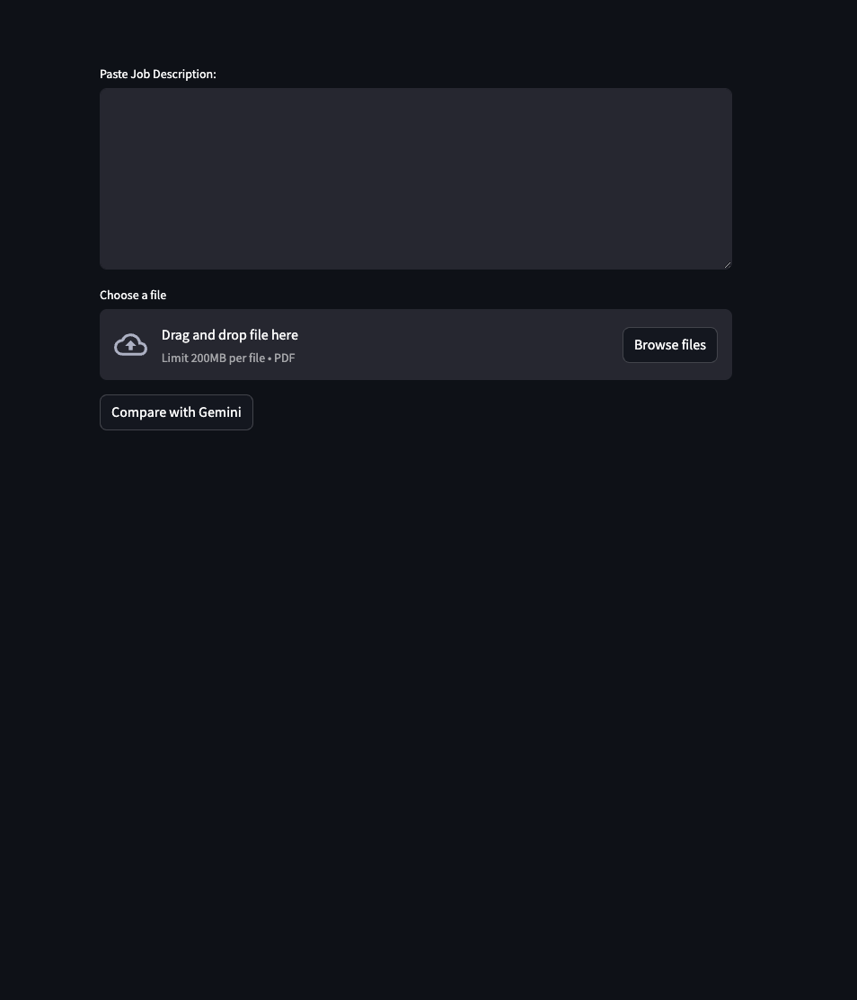
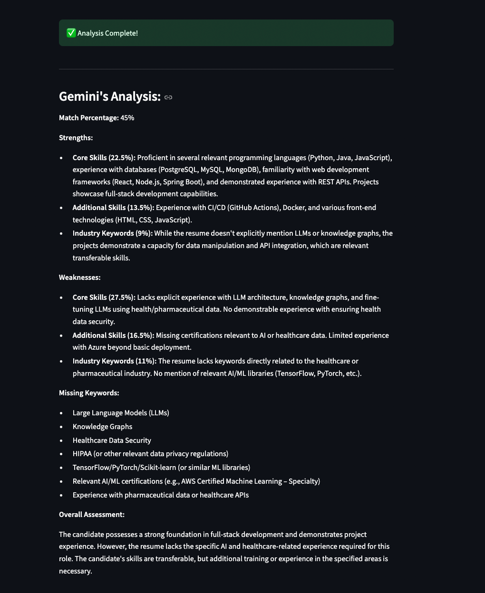

# ATS Resume Evaluator
A Streamlit-powered tool that compares a resume against a job description using Google's Gemini AI. The app extracts text from a PDF and evaluates its relevance to a job description, providing a match percentage, identifying missing keywords, and suggesting improvements to help optimize resumes for Applicant Tracking Systems (ATS).




## Features
✅ Upload a PDF resume for analysis <br/>
✅ Extract text using OCR (Pytesseract) <br/>
✅ Compare resume vs. job description <br/>
✅ Get a match percentage based on relevance <br/>
✅ Identify missing keywords <br/>
✅ Plan for a future improvement suggestion feature

## Tech Stack
- Python <br/>
- Streamlit (Frontend) <br/>
- Google Gemini AI (Resume analysis) <br/>
- pytesseract (OCR for text extraction) <br/>
- pdf2image (Convert PDFs to images)

## Installation
### Prerequisites
- Python 3.3.2+ installed (Check with `python --version`)
- (Optional) Virtual environment tool like `venv` (Should come installed with Python 3.3.2 or higher)
### Steps
1. Clone the repository: <br/>
  ```bash
  https://github.com/Saromazzotta/ats.git
  ```
2. Create and activate a virtual environment (optional but recommended):
   ```bash
   python -m venv venv
   source venv/bin/activate # On Windows use `venv\Scripts\activate`
   ```
3. Install dependencies:
  ```bash
  pip install -r requirements.txt
  ```
## API Key Setup
You're going to need an API key to use Google Gemini.
  1. Go to https://aistudio.google.com/apikey
  2. Generate an API key.
  3. Create a `.env` file in the project root and add the following line:
  ```bash   
    MY_API_KEY=your_google_gemini_api_key
  ```
5. Run the Streamlit app:
```bash
  streamlit run streamlit_app.py
````

## How It Works
1. Paste a Job Description – Enter the job description into the text box.
2. Upload Your Resume – Upload a PDF file.
3. Compare with Gemini – Click the button to analyze your resume.
4. Review the Results – See your match percentage, strengths, weaknesses, and missing keywords.

## Future Plans
🔹 Separate "Improve My Resume" feature – A second Gemini request to suggest changes without altering the match percentage. <br/>
🔹 Better keyword extraction – Ensure structured output for easier parsing. <br/>

## Contributing
Feel free to fork this repository and submit pull requests!
